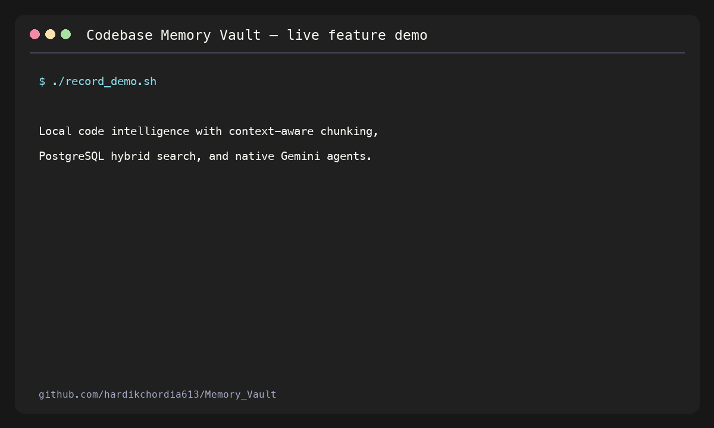

# Codebase Memory Vault

Codebase Memory Vault is a local-first memory and search system for software
projects. It stores source code together with the reason behind that code, then
lets you find it later using normal questions such as:

> Why did we choose PostgreSQL for vector search?

It combines:

- Google Gemini embeddings for meaning-based search;
- PostgreSQL full-text search for exact words;
- `pgvector` and PostgreSQL indexes for fast retrieval;
- Reciprocal Rank Fusion (RRF) to combine both result lists;
- Tree-sitter-aware chunking for code, Markdown, JSON, and YAML;
- a native Gemini multi-agent workflow for code review and test planning;
- a small Python CLI built directly with `psycopg2`—no ORM or agent framework.

The database runs locally in Docker. Gemini is used only for embeddings and the
optional AI review workflow.

## Demo



Run the same live walkthrough yourself:

```bash
./record_demo.sh
```

See [DEMO_RECORDING_GUIDE.md](DEMO_RECORDING_GUIDE.md) to regenerate the GIF.

## Why this project exists

Code tells us *what* a system does, but it often does not explain *why* it was
built that way. That missing context causes repeated bugs and repeated debates.

For example, imagine this code:

```python
timeout = 30
```

Six months later, nobody remembers why the timeout is 30 seconds. Memory Vault
stores the code with a developer note:

```text
The payment provider occasionally takes 20 seconds, so we use 30 seconds to
avoid cancelling valid payments.
```

A future developer can ask, "Why is the payment timeout 30 seconds?" and find
both the code and the decision behind it.

## Main features

| Feature | What it does |
| --- | --- |
| Developer memories | Stores code and the reasoning behind it together. |
| Semantic search | Finds text with a similar meaning, even when the words differ. |
| Keyword search | Finds exact technical terms such as function names and error codes. |
| Hybrid ranking | Combines semantic and keyword rankings using RRF. |
| Context-aware chunking | Splits files around functions, classes, headings, and config keys. |
| Multi-agent review | Uses Historian, Architect, and QA tools under a Gemini Supervisor. |
| Local database | Runs PostgreSQL and `pgvector` on the developer's machine. |
| Lightweight stack | Uses the official SDKs and raw SQL without LangChain or an ORM. |

## How the system works

There are two main flows: storing a memory and searching memories.

### 1. Storing a memory

```text
Code + developer explanation
            |
            v
   Build one text payload
            |
            v
 Gemini creates 768 numbers
       (an embedding)
            |
            v
 Normalize the vector to length 1
            |
            v
 Store text + vector in PostgreSQL
```

An embedding is simply a list of numbers that represents the meaning of text.
Text with a similar meaning usually has a nearby vector.

Example:

```bash
python -m vault.cli push \
  --context "JWT tokens expire after 15 minutes to limit damage from a leak" \
  --code "ACCESS_TOKEN_TTL = 15 * 60" \
  --file "auth/settings.py"
```

The service combines the context, file path, and code before asking Gemini for
an embedding. PostgreSQL stores the original values and the embedding.

### 2. Searching memories

```text
User question
     |
     +-------------------------+
     |                         |
     v                         v
Gemini embedding        PostgreSQL keywords
     |                         |
     v                         v
Top 20 semantic         Top 20 keyword
results                 results
     |                         |
     +------------+------------+
                  |
                  v
        Reciprocal Rank Fusion
                  |
                  v
          Final ranked results
```

The entire fusion happens in one PostgreSQL query.

#### Semantic search

Semantic search compares the query embedding with stored embeddings using
cosine distance:

```sql
embedding <=> query_embedding
```

This helps when words differ but meaning is similar. For example, "login bug"
can still match a memory that says "authentication failure."

The HNSW index uses `vector_cosine_ops`, which matches the `<=>` operator.

#### Keyword search

PostgreSQL automatically builds a `tsvector` from the developer context and
raw code:

```sql
to_tsvector('english', developer_context || ' ' || raw_code)
```

The GIN index makes exact searches fast. This is useful for terms such as
`OAuthHandler`, `ERR_CONNECTION_RESET`, or `validate_token`.

#### Reciprocal Rank Fusion

Semantic and keyword scores are different kinds of numbers, so comparing them
directly would be unreliable. RRF combines their *positions* instead:

```text
score = 1 / (60 + semantic rank) + 1 / (60 + keyword rank)
```

Example:

- a result ranked 1st semantically receives `1 / 61`;
- if it is also ranked 2nd by keywords, it receives another `1 / 62`;
- appearing near the top of both lists gives it a stronger final score.

An RRF score is a ranking value, not a match percentage. The CLI therefore
shows the RRF score and both source ranks.

## Context-aware file chunking

Large files should not be embedded as one unstructured block. The public entry
point is:

```python
from vault.chunker import chunk_file

text = open("vault/service.py", encoding="utf-8").read()
chunks = chunk_file("vault/service.py", text)
```

Each result contains embedding-ready text and metadata:

```python
{
    "text": "File: service.py > Class: MemoryVaultService > Method: ask\n\n...",
    "metadata": {
        "file_path": "vault/service.py",
        "chunk_type": "method",
        "start_line": 77,
        "end_line": 94,
    },
}
```

The strategy depends on the file type:

### Code: `.py`, `.js`, `.jsx`, `.ts`, `.tsx`, `.java`, `.go`, `.rs`

Tree-sitter builds an Abstract Syntax Tree (AST). The chunker extracts functions,
methods, classes, interfaces, traits, and implementations.

- Small classes stay together as one chunk.
- Large classes are split into methods.
- Breadcrumbs preserve the file, class, and method context.
- Source byte positions and line numbers are retained in metadata.

### Markdown: `.md`, `.mdx`

Markdown is split using heading hierarchy rather than arbitrary line counts.

```text
File: README.md > Setup > Database
```

Headings inside fenced code blocks are correctly ignored.

### Configuration: `.json`, `.yaml`, `.yml`

Small files stay whole. Large files are split by meaningful key paths:

```text
File: docker-compose.yml > Key: services.postgres
```

### Plain text and logs

Other files use recursive character splitting. The splitter prefers:

1. blank lines;
2. single line breaks;
3. spaces;
4. a hard character boundary only when necessary.

The default target is 1,000 characters with about 150 characters of overlap.
Overlap helps preserve meaning that crosses a chunk boundary.

> The current CLI `push` command stores the supplied snippet as one memory.
> `chunk_file()` is available for batch ingestion tools that need file-aware
> preprocessing.

## Multi-agent code review

The multi-agent workflow uses the official `google-genai` SDK. It does not use
LangChain, CrewAI, or LangGraph.

```text
Developer request
       |
       v
Gemini Supervisor
       |
       +--> Historian: searches stored decisions and bug history
       |
       +--> Architect: reads requested repository files
       |
       +--> QA Engineer: creates manual and automated tests
       |
       v
Final grounded review
```

The Supervisor chooses tools through native Gemini function calling. Python
executes each requested function and returns its result with
`Part.from_function_response(...)`. The loop stops when Gemini returns normal
text instead of another tool call.

Run it from Python:

```bash
python - <<'PY'
from vault.agents import run_code_review_workflow

run_code_review_workflow(
    "Review vault/db.py for correctness and create regression tests."
)
PY
```

Safety controls include:

- repository-only file access;
- path traversal protection;
- file and context size limits;
- a maximum number of tool rounds;
- tool errors returned to the Supervisor instead of silently disappearing;
- automatic SDK tool execution disabled so every local call is explicit.

## Project structure

```text
Memory_Vault/
├── docker-compose.yml      # Starts local PostgreSQL with pgvector
├── init.sql                # Table, generated search vector, HNSW and GIN indexes
├── requirements.txt        # Python dependencies
├── vault/
│   ├── agents.py           # Gemini Supervisor and specialist tools
│   ├── chunker.py          # Context-aware hybrid file chunker
│   ├── cli.py              # Command-line interface
│   ├── config.py           # Environment configuration
│   ├── db.py               # Raw SQL and PostgreSQL connection management
│   ├── embedder.py         # Gemini embedding client and normalization
│   └── service.py          # Application-level push, ask, list and delete logic
└── tests/                  # Unit tests for each layer
```

## Requirements

- Python 3.10 or newer
- Docker and Docker Compose
- a Gemini API key from [Google AI Studio](https://aistudio.google.com/)

## Setup

### 1. Clone the repository

```bash
git clone https://github.com/hardikchordia613/Memory_Vault.git
cd Memory_Vault
```

### 2. Create a virtual environment

```bash
python3 -m venv .venv
source .venv/bin/activate
```

On Windows PowerShell:

```powershell
.venv\Scripts\Activate.ps1
```

### 3. Install dependencies

```bash
pip install -r requirements.txt
```

### 4. Configure environment variables

```bash
cp .env.example .env
```

Edit `.env`:

```dotenv
GEMINI_API_KEY=your_real_api_key
EMBEDDING_MODEL=models/gemini-embedding-001
AGENT_MODEL=gemini-3.6-flash

DB_HOST=localhost
DB_PORT=5432
DB_NAME=memory_vault
DB_USER=postgres
DB_PASSWORD=postgres
```

Never commit the real `.env` file. It is ignored by Git.

### 5. Start PostgreSQL

```bash
docker compose up -d
```

The first startup runs `init.sql` automatically. It enables `pgvector`, creates
the table, and builds the search indexes.

If an older local database already has a different vector dimension, back up
any important memories and recreate that development database before testing.
PostgreSQL cannot automatically convert incompatible embedding dimensions.

### 6. Check system health

```bash
python -m vault.cli doctor
```

The command checks configuration, PostgreSQL connectivity, the `pgvector`
extension, and the number of stored memories.

## CLI commands

### Store a memory

Inline code:

```bash
python -m vault.cli push \
  --context "Use a transaction so partial writes are rolled back" \
  --code "with connection: save_order(order)" \
  --file "orders/service.py"
```

Read code from a file:

```bash
python -m vault.cli push \
  --context "Database access is isolated behind DatabaseManager" \
  --file "vault/db.py"
```

### Search memories

```bash
python -m vault.cli ask "Why do database writes use transactions?"
```

Limit the result count:

```bash
python -m vault.cli ask "authentication regression" --limit 3
```

### List recent memories

```bash
python -m vault.cli list --limit 10
```

### Delete a memory

```bash
python -m vault.cli delete 123e4567-e89b-12d3-a456-426614174000
```

### Check health

```bash
python -m vault.cli doctor
```

## Database schema

The project uses one main table:

```sql
CREATE TABLE code_memories (
    id UUID PRIMARY KEY DEFAULT gen_random_uuid(),
    file_path VARCHAR(512),
    developer_context TEXT NOT NULL,
    raw_code TEXT NOT NULL,
    embedding VECTOR(768) NOT NULL,
    search_vector tsvector GENERATED ALWAYS AS (
        to_tsvector('english', developer_context || ' ' || raw_code)
    ) STORED,
    created_at TIMESTAMP WITH TIME ZONE DEFAULT CURRENT_TIMESTAMP
);
```

Each column has a simple purpose:

| Column | Purpose |
| --- | --- |
| `id` | Unique identifier for one memory. |
| `file_path` | Optional source file related to the memory. |
| `developer_context` | The reason, decision, bug history, or explanation. |
| `raw_code` | The code or configuration being remembered. |
| `embedding` | 768 numbers used for semantic search. |
| `search_vector` | Automatically generated tokens used for keyword search. |
| `created_at` | Time when the memory was stored. |

Two indexes serve different jobs:

```sql
CREATE INDEX idx_code_memories_embedding
ON code_memories USING hnsw (embedding vector_cosine_ops);

CREATE INDEX idx_code_memories_search_vector
ON code_memories USING GIN (search_vector);
```

- HNSW accelerates cosine vector search.
- GIN accelerates PostgreSQL full-text search.

## Running tests

Run all tests:

```bash
pytest -v
```

Run with coverage:

```bash
pytest --cov=vault --cov-report=term-missing
```

The tests mock external Gemini and PostgreSQL calls, so the unit suite does not
spend API quota or require a running database.

## Common problems

### `GEMINI_API_KEY is not configured`

Add a valid key to `.env` and restart the command.

### PostgreSQL connection refused

Check the container:

```bash
docker compose ps
docker compose logs postgres
```

### Vector dimension error

The application and schema use 768 dimensions. If an old development database
used another size, recreate it and re-embed its memories.

### Keyword-only or semantic-only result

This is valid. The `FULL OUTER JOIN` keeps a result even when it appears in only
one of the two top-20 lists. The missing source rank is shown as `—` in the CLI.

## Design choices

- **Raw SQL:** makes the hybrid query visible and keeps RRF inside PostgreSQL.
- **No heavy frameworks:** reduces dependencies and hides less behavior.
- **Stored generated `tsvector`:** PostgreSQL updates keywords automatically
  whenever context or code changes.
- **768-dimensional embeddings:** reduce storage and fit the HNSW index while
  retaining strong retrieval quality.
- **Explicit normalization:** makes truncated embeddings safe for cosine search
  and keeps their vector length consistent.
- **Lazy parser loading:** only loads a Tree-sitter language when that file type
  is actually chunked.

## Current scope

This is a developer-focused local project. Before exposing it as a shared
service, add authentication, authorization, rate limiting, database backups,
secret management, observability, and integration tests against a real
PostgreSQL instance.
